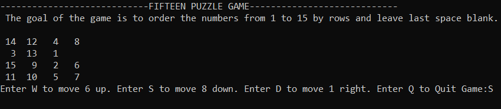

# 15-Puzzle-Game-in-C
Final project of Programming classes in second semester of Computer Science studies.

Game is written in C language and doesn't use any additional libraries, so the game works in console. It was necessery to use dynamic structures, so I applied a linked list.

## How does the game work?
When the game starts, a user sees game's rules and a 4x4 board, in which numbers from 1 to 15 have been randomly placed and one box is blank. Then a user can use 5 different keys:
- **w**, to change position of a blank space and a number below it
- **s**, to change position of a blank space and a number above it
- **a**, to change position of a blank space and a number on the right
- **d**, to change position of a blank space and a number on the left
- **q**, to quit the game

**The aim of the game** is to order the numbers from 1 to 15 leaving last box blank. If a user wins, he sees *Congratuations message* and a number of moves he has needed to win.

## How to run?
- Clone this repository.
- Run **15-Puzzle-Game.exe** file

## Documentation
If you are interested in how each function works, take a look at the [documentation](documentation.pdf).

###### In addition
Currently I am working on 15 Puzzle Game using HTML,Sass and JavaScript. [Check this out!](https://github.com/Lyczeq/15-Puzzle-Game-Frontend)
